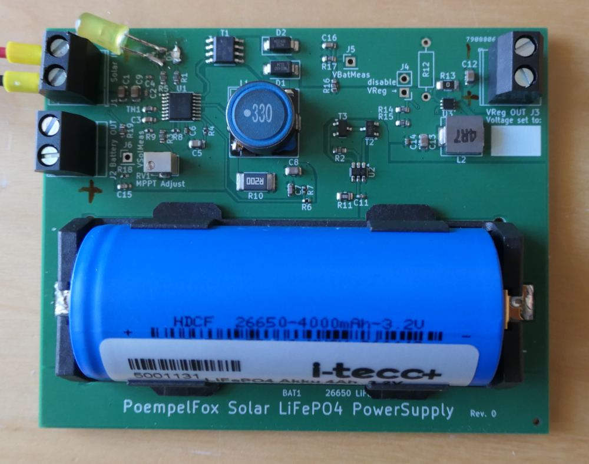
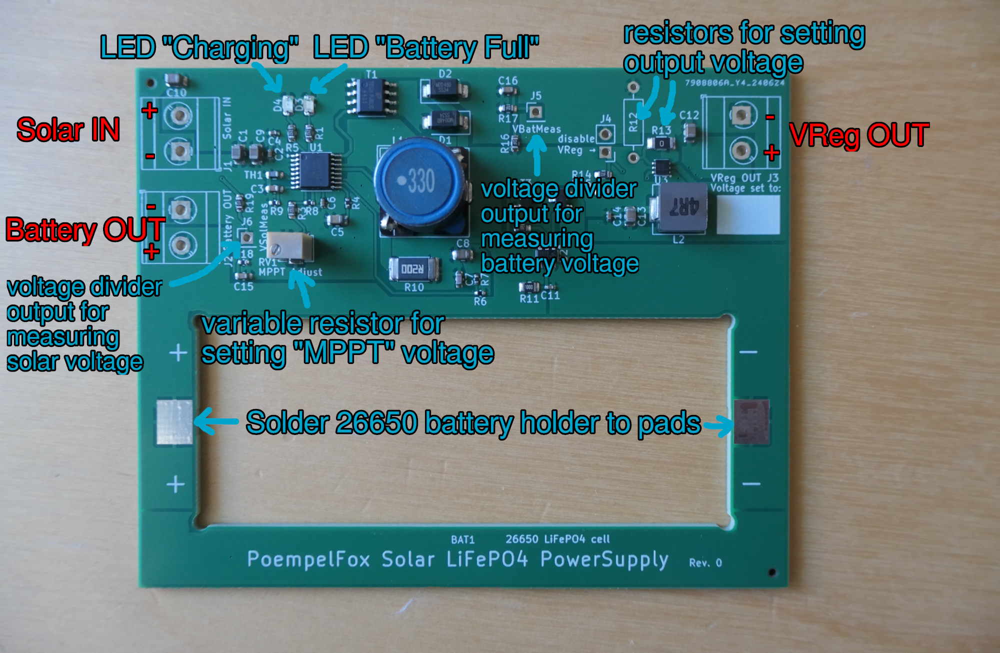

# Solar-LiFePO4 power-supply module

## Intro

The goal of this project is to build a power-supply
module with a standard 26650 LiFePO4 battery that can
be powered from a small solar panel and will take
care of all the handling of the battery, including
protection, for you.
The battery is put into a battery holder that is
directly on the board.

Essentially, this is trying to build something
very similiar to Waveshares "Solar Power Manager",
just using LiFePO4 instead of Li-Ion. The
downside is the smaller energy density. The upside
is that LiFePO4 is much much more stable and simply
can not spontanously burst into flames.

I would have preferred to not design this myself,
because I'm really out of my depth here. However,
I was completely unable to find something ready-made
to buy, and even my search for (open-source-)projects
that had already built something like that proved
fruitless. Of course, after I was two-thirds finished,
I accidently found the
[LiFePO4 Solar Charger by Stefan Wagner](https://github.com/wagiminator/Power-Boards/blob/master/Solar_Charger/readme.md)
that would have been almost exactly what I was looking
for, but by then it was too late.

During construction,
[a blog entry by Malte Poeggel and his design files](https://www.maltepoeggel.de/?site=solar-mppt-cn3722&lang=en)
was a great inspiration, because it uses the same
main charge controller (CN3722) and so I had a known-working
design to start from.

## Features

Input is meant to be a 12V solar panel. Maximum input
voltage for the circuit is 25V, so the solar panel
voltage without any load should be fine.

The board has a slot for a standard 26650 LiFePO4
flat top unprotected battery. The protection circuit
(HY2112) is on the board and protects against
short circuits, overcharge, and deep discharge.
There is also protection against charging below
0°C (which can damage LiFePO4 batteries), but that
is done by the main CN3722 charge controller which has
a Thermistor connected for that purpose. Note that
because the Thermistor is on the board and not
directly attached to the battery, this may be
insufficient for some use cases where large
temperature differences between board and battery
can occour.

Charge current is capped at 1A.

There is a regulated 5V output through an ultra-
efficient MAX17224 boost converter. Output voltage can
be reconfigured to between 3.4 - 5V by removing and
soldering in another resistor. However, because this
is a boost converter, you cannot (reliably) go below
3.4V - the minimum voltage is (battery voltage - 0.2V).
You should be able to pull around 400 mA at 5V or
600 mA at 3.4V out of this - although if you pull this
much current permanently, you'll not last long
with such a small battery.

You can also get the 3.0V - 3.6V output coming from
the battery directly, but that is of course completely
unregulated, and will fluctuate as the battery charges
and discharges. This output is behind the battery
protection circuit, so protected against deep
discharge.

There is a jumper for disabling the boost converter
completely if you don't need the regulated output.
It's also possible to connect a microcontroller to
that jumper and thereby enable/disable the regulated
output in software. A nifty feature of the MAX17224
is that when it is disabled, it completely disconnects
its output, meaning it doesn't care at all if you
feed voltage into that.

Finally, there are two voltage dividers on the board,
with an output that is intended to be connected to
an ADC pin of a microcontroller. A 10 MOhm / 1 MOhm
divider to measure the voltage coming from the solar
panel, and a 10 MOhm / 10 MOhm divider for the battery
voltage. These were selected so that the output
conveniently matches the range of your standard ESP32.

